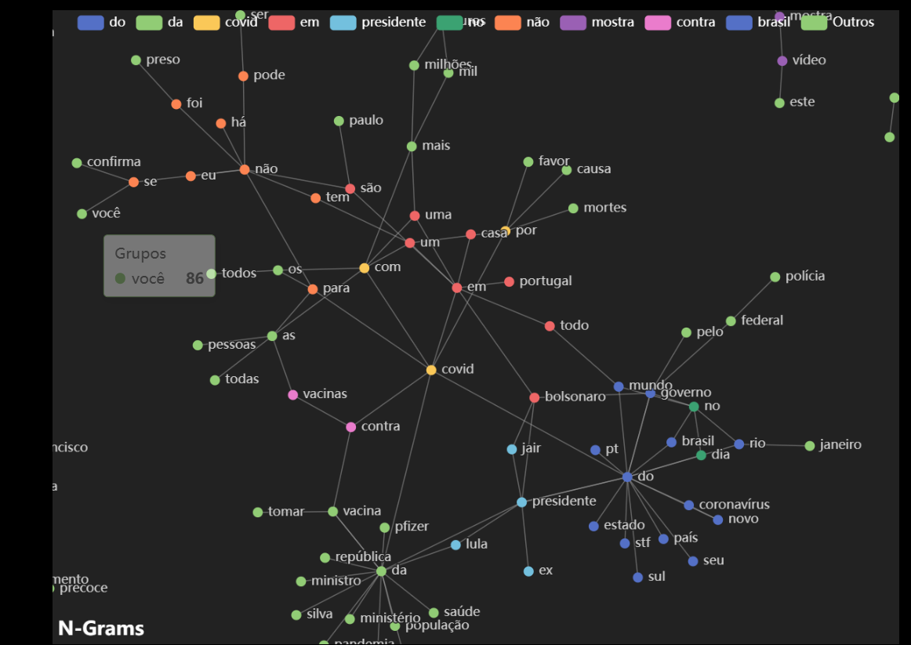

## LLM-PHP

Bem-vindo ao projeto **Modelo de Linguagem Básico com PHP**! Este repositório oferece uma abordagem fundamental para a construção de um Modelo de Linguagem (LLM) simples utilizando PHP. Embora não seja tão avançado quanto modelos contemporâneos como o ChatGPT, este projeto serve como um excelente ponto de partida para entender os conceitos essenciais por trás do processamento de linguagem natural e do desenvolvimento de chatbots.

Pois o proposito desse repositório é apenas para estudo de como um LLM funciona por baixo dos panos, aqui existem muitas limitações de uso, uma delas foram os dados utilizados, baixei uma base (dataset) sobre fake news do site https://www.kaggle.com/.
Mas fake news? é pelo motivo de uma pequisa que estou realizando para outra implementação usando python, e resolvi fazer em php por ser minha linguagem principal e pelo motivo da linguagem python esconder muitas coisas que eu queria ver acontecendo.

ouseja caso queira usar a propria fonte de dados precisa alterar o arquivo fakenews.csv para seu proprio dataset e executar na ordem, olhe dentro do csv e no json dados processados para ver sua estrutura:
```
php runClearData.php

php runNGramProcessor.php

php runTrainModel.php


```

## Características

- **Extração de Dados:** Métodos para coletar e compilar dados para treinamento, no caso desse projeto houve a extração de uma dataset pronto.
- **Limpeza de Dados:** Técnicas para pré-processar e sanitizar o dataset, os dados que vieram no data set possuem titulos e links e outros caracteres que precisavam de uma transformação.
- **Criação de N-Grams:** Construção de n-grams para entender sequências de palavras, aqui é contado a quantidade de palavras que aparecem no texto.
- **Vetorização:** Transformação de dados textuais em vetores numéricos para treinamento do modelo.
- **Treinamento do Modelo:** Treinamento de um classificador Naive Bayes para previsão de palavras.
- **Testes de Previsão:** Validação da precisão do modelo na previsão da próxima palavra.
- **Implementação do Chatbot:** Interface básica de chatbot com limitações inerentes.

## Pré-requisitos

Antes de começar, certifique-se de ter atendido aos seguintes requisitos:

- **PHP 7.4 ou superior**
- **Composer** para gerenciamento de dependências
- **Servidor Web:** Apache, Nginx ou qualquer servidor capaz de executar scripts PHP
- **Conhecimentos Básicos de PHP e Conceitos de Aprendizado de Máquina**
- **computador** com pelo menos 16gb de RAM

## Instalação

1. **Clone o Repositório:**

    ```bash
    git clone https://github.com/faustinopsy/modelo-llm-php.git
    cd modelo-llm-php
    ```

2. **Instale as Dependências:**

    Assegure-se de ter o Composer instalado. Em seguida, execute:

    ```bash
    composer install
    ```

4. **Configure o Servidor Web:**

    na raiz do projeto pode iniciar o servidor.

    ```
    php -S localhost:8080
    ```

## Estrutura do Projeto
```
/new_Chat
│backend
│ ├── /model (a pasta irá vazia, precisa executar os passos acima, pois o arquivo naive_bayes_model tem 800mb)
│ ├──--- naive_bayes_model.phpml 
│ ├──--- vectorizer.phpml 
│ └──--- feature_selector.phpml 
│ ├── /utils 
│ └──---- ClearData.php 
│ └──---- NextWordPredictor.php 
│ └──---- NGramProcessor.php 
│ └── vendor/
│ ├── composer.json 
│ ├── fakes.csv
│ ├── ngrams.json
│ ├── runClearData.php
│ ├── runNGramProcessor.php
│ ├── runPredict.php
│ ├── runTrainModel.php
│ ├── composer.json 
└── index.html

```

## Pontos importantes sobre o aprendizado de máquina
1. Limpeza dos Dados
Objetivo: Pré-processar o dataset para remover ruídos e informações irrelevantes.

Passos:

Conversão para Minúsculas: Converta todo o texto para minúsculas para manter a consistência.
Remoção de Pontuação: Elimine marcas de pontuação que não contribuem para a previsão de palavras.
Remoção de Stop Words: Opcionalmente, remova palavras comuns (ex.: "o", "e", "é") para focar em palavras significativas. (altamente recomendado quando esta criando o próprio modelo)
Tokenização: Divida o texto em palavras ou tokens individuais.

2. Criação de N-Grams
Objetivo: Analisar sequências de palavras para entender o contexto e prever palavras subsequentes.

O que é um N-Gram?
Um n-gram é uma sequência contínua de 'n' itens (geralmente palavras) de uma amostra de texto. No processamento de linguagem natural, n-grams são usados para prever a probabilidade de uma palavra com base nas (n-1) palavras precedentes.

Unigram: Uma única palavra (n=1)
Bigram: Duas palavras consecutivas (n=2)
Trigram: Três palavras consecutivas (n=3) (o modelo atual esta aqui, pois o tamanho do modelo fica menor)

Exemplo:

Para a frase "Eu amo programar em PHP", os bigrams são:

"Eu amo"
"amo programar"
"programar em"
"em PHP"


Embeddings e N-Grams
Embeddings e n-grams são duas abordagens distintas para representar e analisar dados textuais em processamento de linguagem natural.


Embeddings
Definição: Representações vetoriais densas de palavras que capturam relações semânticas e sintáticas.
Utilização: Cada palavra é representada por um vetor de números contínuos, permitindo cálculos de similaridade e outras operações matemáticas.
Vantagens: Capturam relações semânticas complexas entre palavras (ex.: similaridade, analogias).
Desvantagens: Requer mais recursos computacionais para treinamento e armazenamento.
Comparação:

Contexto: N-grams capturam sequências fixas de palavras, enquanto embeddings capturam relações semânticas independentes da ordem.
Complexidade: N-grams são mais simples e menos intensivos em recursos, enquanto embeddings exigem treinamento mais complexo.
Aplicações: N-grams são úteis para tarefas como previsão de palavras e análise de frequência, enquanto embeddings são essenciais para tarefas que requerem entendimento semântico, como tradução automática e resposta a perguntas.
Medidas de Proximidade
Medidas de proximidade determinam a similaridade ou distância entre dois vetores. Medidas comuns incluem:


3. Vetorização
Objetivo: converter dados textuais em vetores numéricos que modelos de aprendizado de máquina podem interpretar. Essa transformação captura o significado semântico e as relações entre as palavras.

Passos:

Tokenização: Dividir o texto em tokens (palavras).
Criação de Vetores: Atribuir valores numéricos aos tokens com base na frequência ou outras métricas.
Seleção de Features: Selecionar características relevantes para melhorar o desempenho do modelo.


4. Treinamento do Modelo
Objetivo: Treinar um modelo de aprendizado de máquina para prever a próxima palavra com base no contexto fornecido.

normalmente já existem os algoritmos especializados para treinamento, cada algoritmo é utilizado para um fim especifico

Alguns.
- Classificador NaiveBayes
Classificador baseado na aplicação do teorema de Bayes com fortes suposições de independência (ingênuas) entre os recursos.

- Classificador KNearestNeighbors
Classificador que implementa o algoritmo k-vizinhos mais próximos.

- Agrupamento de K-means
O algoritmo K-Means agrupa dados tentando separar amostras em n grupos de variância igual, minimizando um critério conhecido como inércia ou soma dos quadrados dentro do cluster. Este algoritmo requer que o número de clusters seja especificado.

5. Testes de Previsão
Objetivo: Validar a precisão do modelo na previsão da próxima palavra com base em diferentes contextos.

Normalmente testa o modelo criado com parte dos dados da extração


## Limitações
- Compreensão Básica: O chatbot possui entendimento limitado do contexto.
- Vocabulário Restrito: Limitado ao vocabulário presente no dataset.
- Sem Memória: Não retém histórico de conversas.
- Possibilidade de Alucinações: Pode gerar palavras sem sentido ou irrelevantes.
- Comprimento de Resposta Fixado: Limitado a um número pré-definido de palavras.


## Aplicações:

Previsão de texto
Reconhecimento de fala
Tradução automática
Vetorização
A vetorização transforma dados textuais em vetores numéricos. Este processo é essencial para modelos de aprendizado de máquina, que requerem entrada numérica.

## Técnicas:

Bag of Words (BoW): Conta a frequência de cada palavra em um documento.
Term Frequency-Inverse Document Frequency (TF-IDF): Pesa a importância de uma palavra com base em sua frequência em um documento em relação à frequência em todos os documentos.
Word Embeddings: Representa palavras em espaço vetorial contínuo (ex.: Word2Vec, GloVe).
Medidas de Proximidade
Medidas de proximidade determinam a similaridade ou distância entre dois vetores. Medidas comuns incluem:

Similaridade Cosseno: Mede o cosseno do ângulo entre dois vetores.
Distância Euclidiana: Mede a distância em linha reta entre dois pontos no espaço.
Distância de Manhattan: Mede a distância entre dois pontos ao longo dos eixos em ângulos retos.
Aplicações:

Similaridade de documentos
Agrupamento
Classificação
Geração de Palavras
A geração de palavras envolve prever ou criar a próxima palavra em uma sequência com base no contexto fornecido. Este processo é fundamental para modelos de linguagem e chatbots.

## Desafios:

Compreensão de Contexto: Entender o significado por trás das palavras.
Coerência: Garantir que as palavras geradas formem frases significativas.
Evitar Repetição: Prevenir que o modelo repita palavras excessivamente.
Limitações
Embora este LLM básico sirva como um projeto fundamental, possui várias limitações:

Flutuações e Alucinações: O modelo pode gerar palavras irrelevantes ou sem sentido devido à limitação de dados de treinamento e algoritmos simplistas.
Falta de Compreensão Profunda: O chatbot não compreende o contexto além das sequências de palavras.
Vocabulário Fixado: Limitado às palavras presentes no dataset de treinamento.
Problemas de Escalabilidade: Não otimizado para aplicações em grande escala ou em tempo real.
Por que PHP?
A escolha do PHP para este projeto foi motivada por vários fatores:

## Facilidade de Deploy:

PHP é amplamente suportado em plataformas de hospedagem compartilhada, facilitando a implantação e reduzindo custos.
- Hospedagem Econômica:

Soluções de hospedagem compartilhada para PHP são geralmente mais baratas em comparação com ambientes necessários para linguagens mais complexas como Python.
Familiaridade:

Aproveitar o conhecimento existente de PHP permite desenvolvimento e iteração rápida.
Contribuição para o Ecossistema PHP:

Objetivo de contribuir de volta para a comunidade PHP, aprimorando as classes PHP e demonstrando a versatilidade do PHP em aplicações de aprendizado de máquina.
Contribuindo
Contribuições são bem-vindas! Seja melhorando a documentação, adicionando novas funcionalidades ou corrigindo bugs, sua ajuda é apreciada.


## criador do mecanismo de busca especializado  WolframAlph a – resume o ChatGPT:
```
“O conceito básico do ChatGPT é, em algum nível, bastante simples. 
Comece com uma amostra enorme de texto criado por humanos da web, livros, etc. 
Então treine uma rede neural para gerar texto que seja “como este”. 
E, em particular, faça com que ela seja capaz de começar com um “prompt” e então continuar com texto que seja “como o que foi treinado”.

Como vimos, a rede neural real no ChatGPT é composta de elementos muito simples — embora bilhões deles. 
E a operação básica da rede neural também é muito simples, consistindo essencialmente em passar a entrada derivada do texto que ela gerou até agora “uma vez por seus elementos” (sem nenhum loop, etc.) para cada nova palavra (ou parte de uma palavra) que ela gera.

Mas o notável — e inesperado — é que esse processo pode produzir texto que é com sucesso “como” o que está disponível na web, em livros, etc. (...)

A engenharia específica do ChatGPT o tornou bastante atraente. 
Mas, no final das contas (pelo menos até que possa usar ferramentas externas), o ChatGPT está “meramente” extraindo algum “fio coerente de texto” das “estatísticas da sabedoria convencional” que ele acumulou. 
Mas é incrível como os resultados são semelhantes aos humanos.”
```

## novas funcionalidades
graficos dos Ngrams


